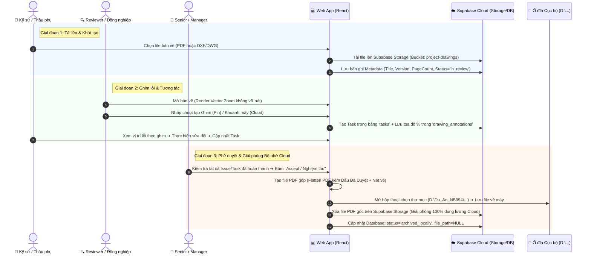

# Bản Kế hoạch Chi tiết: Hệ thống Quản lý & Đánh dấu Bản vẽ Kỹ thuật (Drawing Markup & Archiving Lifecycle)

Tài liệu này tổng hợp toàn bộ giải pháp kỹ thuật, kiến trúc dữ liệu, luồng nghiệp vụ và kế hoạch thực hiện cho tính năng **Xem, Ghim Task, Đánh dấu trên Bản vẽ và Đóng gói Nghiệm thu Lưu trữ Cục bộ (Local Archiving)**.

---

## 1. Bức tranh Toàn cảnh & Vòng đời Bản vẽ (End-to-End Workflow)



---

## 2. Giải pháp Công nghệ Chi tiết (Tech Stack & Architecture)

### 2.1. Đảm bảo Bản vẽ KHÔNG BỊ VỠ KHI PHÓNG TO (Crisp Vector Zooming)
* **Thư viện chính:** `pdfjs-dist` (Mozilla PDF.js) + `react-zoom-pan-pinch`.
* **Cơ chế hoạt động:**
  1. Khi người dùng zoom/pan: Dùng CSS transform `matrix()` tức thì để tạo cảm giác mượt mà 60fps.
  2. Khi người dùng dừng thao tác (Debounce 150ms): Hàm `page.render()` được gọi lại với `scale = currentZoomFactor * window.devicePixelRatio`.
  3. Mọi đường kính ống, ký hiệu van, text kích thước đều được vẽ lại từ vector gốc của AutoCAD, **sắc nét 100% ở mọi cấp độ phóng to (từ 50% đến 1000%)**.

### 2.2. Xử lý Tọa độ Phần trăm (Normalized Spatial Coordinates)
* Không dùng tọa độ pixel cứng (ví dụ `x=500px, y=300px` sẽ bị lệch khi đổi màn hình).
* **Công thức chuẩn hóa:**
  $$\text{x\_percent} = \frac{\text{clickX} - \text{rect.left}}{\text{rect.width}} \times 100$$
  $$\text{y\_percent} = \frac{\text{clickY} - \text{rect.top}}{\text{rect.height}} \times 100$$
* Bất kể bản vẽ hiển thị trên màn hình laptop 14 inch, màn hình 4K hay điện thoại, Ghim luôn nằm **chính xác tuyệt đối trên cùng 1 mối nối/chi tiết kỹ thuật**.

### 2.3. Quy trình Xuất & Đóng gói Cục bộ (Export & Local Archiving)
* **Thư viện đóng gói:** `pdf-lib` (Chạy trực tiếp trên trình duyệt Client-side, không tốn tài nguyên server).
* **API lưu ổ đĩa:** Web File System Access API (`window.showSaveFilePicker()`):
  * Mở cửa sổ Explorer chuẩn của Windows để Manager chọn folder và tên file.
  * Tương thích với Chrome, Edge, Opera. Fallback sang auto-download với các trình duyệt cũ.
* **Cơ chế giải phóng Storage:**
  * Gọi API `supabase.storage.from('project-drawings').remove([filePath])` để xóa ngay file nặng trên Cloud.
  * DB giữ lại lịch sử công việc, người duyệt, ngày duyệt nhưng **dung lượng lưu trữ Cloud về 0 MB**.

---

## 3. Thiết kế Cơ sở Dữ liệu (Supabase SQL Schema)

Tạo file migration: `supabase/migrations/012_drawing_system.sql`

```sql
-- 1. Bảng quản lý Bản vẽ
CREATE TABLE IF NOT EXISTS public.drawings (
  id UUID PRIMARY KEY DEFAULT gen_random_uuid(),
  project_id UUID NOT NULL REFERENCES public.projects(id) ON DELETE CASCADE,
  title TEXT NOT NULL,
  file_path TEXT,                         -- NULL nếu đã archive về máy cục bộ
  file_size INT,                          -- Bytes
  file_type TEXT DEFAULT 'pdf',           -- 'pdf', 'dxf', 'dwg'
  version TEXT DEFAULT 'Rev 1',
  page_count INT DEFAULT 1,
  status TEXT DEFAULT 'in_review',        -- 'in_review', 'approved_archived', 'rejected'
  metadata JSONB DEFAULT '{}'::jsonb,     -- { width, height, layers: [...] }
  archived_at TIMESTAMPTZ,
  archived_by UUID REFERENCES public.profiles(id),
  created_by UUID REFERENCES public.profiles(id),
  created_at TIMESTAMPTZ DEFAULT now(),
  updated_at TIMESTAMPTZ DEFAULT now()
);

-- 2. Bảng quản lý Ghim Task & Nét vẽ (Annotations)
CREATE TABLE IF NOT EXISTS public.drawing_annotations (
  id UUID PRIMARY KEY DEFAULT gen_random_uuid(),
  drawing_id UUID NOT NULL REFERENCES public.drawings(id) ON DELETE CASCADE,
  page_number INT NOT NULL DEFAULT 1,
  task_id UUID REFERENCES public.tasks(id) ON DELETE SET NULL,
  type TEXT NOT NULL,                     -- 'pin', 'cloud', 'arrow', 'rect', 'stamp'
  x_percent NUMERIC(5,2) NOT NULL,
  y_percent NUMERIC(5,2) NOT NULL,
  vector_data JSONB DEFAULT '{}'::jsonb,  -- { width, height, points: [...] }
  color TEXT DEFAULT '#EF4444',
  label TEXT,
  created_by UUID REFERENCES public.profiles(id),
  created_at TIMESTAMPTZ DEFAULT now(),
  updated_at TIMESTAMPTZ DEFAULT now()
);

-- Index tối ưu truy vấn
CREATE INDEX IF NOT EXISTS idx_drawings_project_id ON public.drawings(project_id);
CREATE INDEX IF NOT EXISTS idx_annotations_drawing_id ON public.drawing_annotations(drawing_id);
CREATE INDEX IF NOT EXISTS idx_annotations_task_id ON public.drawing_annotations(task_id);

-- Storage Bucket
INSERT INTO storage.buckets (id, name, public)
VALUES ('project-drawings', 'project-drawings', true)
ON CONFLICT (id) DO NOTHING;
```

---

## 4. Cấu trúc Thư mục & Chi tiết các Hàm Lập trình

### 4.1. Cấu trúc Source Code mới trong `web/src/`:
```
web/src/
├── components/
│   └── drawing/
│       ├── DrawingViewer.jsx           # Khung chứa chính (Pan/Zoom Canvas + Overlay)
│       ├── PdfCanvas.jsx               # Render PDF vector chất lượng cao (pdfjs-dist)
│       ├── AnnotationOverlay.jsx       # Lớp hiển thị Ghim, Mây, Mũi tên & bắt sự kiện click
│       ├── DrawingToolbar.jsx          # Thanh công cụ: Chọn Pin, Khoanh mây, Mũi tên, Zoom, Trang
│       ├── DrawingSidebar.jsx          # Cột bên phải: Danh sách Task/Ghim + Nút Accept Đóng gói
│       ├── PinMarker.jsx               # Icon ghim nổi, hiển thị số hiệu #Issue & màu trạng thái
│       ├── TaskPinModal.jsx            # Modal tạo Task nhanh khi click vào tọa độ bản vẽ
│       └── ArchiveModal.jsx            # Modal xác nhận Phê duyệt & Đóng gói tải về máy
├── lib/
│   ├── drawingCoords.js                # Tiện ích chuyển đổi tọa độ chuột sang %
│   ├── pdfExporter.js                  # Xuất PDF gộp nét vẽ + Dấu Approved (pdf-lib)
│   └── fileSystemSaver.js              # Xử lý window.showSaveFilePicker() lưu vào máy
└── pages/
    ├── DrawingsListPage.jsx            # Danh sách bản vẽ của dự án (Upload, bộ lọc, trạng thái)
    └── DrawingDetailPage.jsx           # Màn hình thao tác chính trên bản vẽ
```

### 4.2. Danh sách các Hàm Cốt lõi (Core Functions Specification):

#### Module 1: `web/src/lib/drawingCoords.js`
* `calculateNormalizedCoords(mouseEvent, targetElement)`:
  * **Input:** `MouseEvent`, `targetElement` (thẻ Canvas/SVG của trang PDF).
  * **Xử lý:** Lấy `getBoundingClientRect()`, tính vị trí chuột tương đối và chia cho kích thước thực tế.
  * **Output:** `{ x: 45.32, y: 68.15 }` (Tỉ lệ phần trăm 0 - 100).
* `denormalizeCoords(percentX, percentY, currentWidth, currentHeight)`:
  * **Output:** `{ pixelX, pixelY }` để render Ghim lên màn hình hiện tại.

#### Module 2: `web/src/components/drawing/PdfCanvas.jsx`
* `loadPdfDocument(urlOrBlob)`: Gọi `pdfjsLib.getDocument()` nạp dữ liệu bản vẽ.
* `renderPageVector(pageNumber, zoomLevel)`:
  * Tính toán `viewport = page.getViewport({ scale: zoomLevel * window.devicePixelRatio })`.
  * Gắn vào thẻ `<canvas>` và gọi `page.render({ canvasContext, viewport })`.

#### Module 3: `web/src/lib/pdfExporter.js` (Đóng gói & Đóng dấu)
* `exportApprovedPdf(originalPdfUrl, annotationsList, approvalInfo)`:
  * Nạp file PDF gốc bằng `PDFDocument.load()`.
  * Duyệt qua `annotationsList`, vẽ lại các đường viền khoanh mây, mũi tên, text ghi chú lên từng trang.
  * Thêm con dấu **"APPROVED & VERIFIED"** ở góc khung tên (kèm Tên Manager, Ngày giờ, Số lượng Task đã hoàn thành).
  * Trả về file `Uint8Array` sẵn sàng để lưu.

#### Module 4: `web/src/lib/fileSystemSaver.js` (Lưu về máy & Xóa Cloud)
* `saveFileToUserFolder(fileBytes, suggestedName)`:
  * Gọi `window.showSaveFilePicker({ suggestedName, types: [...] })`.
  * Ghi luồng dữ liệu (WritableStream) trực tiếp vào thư mục người dùng đã chọn trên máy tính.
* `cleanupCloudStorage(drawingId, storageFilePath)`:
  * Gọi `supabase.storage.from('project-drawings').remove([storageFilePath])`.
  * Cập nhật bản ghi: `UPDATE drawings SET file_path = NULL, status = 'approved_archived', archived_at = NOW() WHERE id = drawingId`.

---

## 5. Lộ trình Triển khai (Phân đoạn từng bước)

| Giai đoạn | Nội dung công việc | Thời gian dự kiến | Kết quả đạt được |
| :--- | :--- | :--- | :--- |
| **Giai đoạn 1** | Setup Database, Migration SQL & Cài đặt `pdfjs-dist`, `react-zoom-pan-pinch` | Bước 1 | Database sẵn sàng, có trang Viewer xem PDF sắc nét với Pan/Zoom mượt mà. |
| **Giai đoạn 2** | Xây dựng hệ thống Ghim Tọa độ (Spatial Pinning) & Modal tạo Task | Bước 2 | Kỹ sư click vào điểm trên bản vẽ ➔ Tạo task ➔ Ghim hiển thị số hiệu & màu trạng thái. |
| **Giai đoạn 3** | Tương tác 2 chiều (Sidebar Danh sách Task $\leftrightarrow$ Ghim trên bản vẽ) | Bước 3 | Click task ở sidebar tự zoom tới ghim; lọc task theo trạng thái/người phụ trách. |
| **Giai đoạn 4** | Thêm công cụ vẽ vector (Khoanh mây, Mũi tên chỉ dẫn, Highlight) | Bước 4 | Đầy đủ bộ công cụ đánh dấu kỹ thuật chuyên nghiệp. |
| **Giai đoạn 5** | Tính năng Accept, Đóng gói PDF kèm dấu duyệt, Lưu thư mục máy & Tự dọn dẹp Cloud | Bước 5 | Hoàn thiện quy trình nghiệm thu, giải phóng 100% dung lượng Cloud lưu trữ. |
